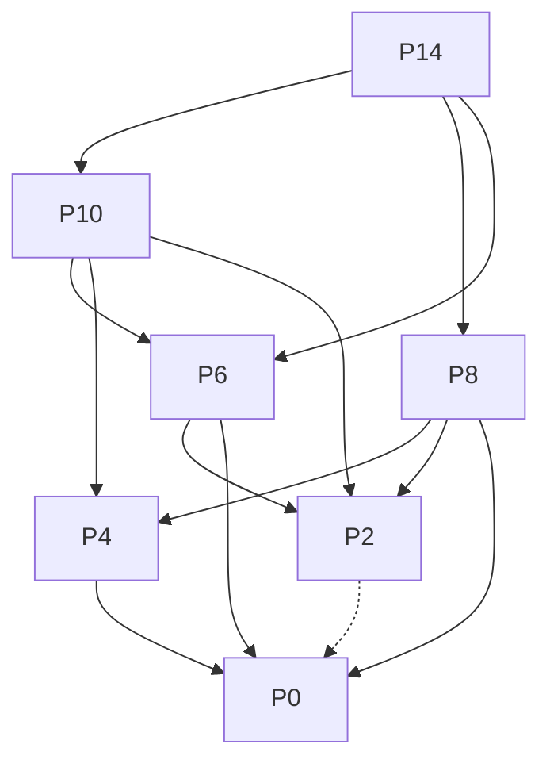

# Answers to Unbounded Knapsack Problem

## (1) Recursive Definition of P(C)

**Base Case:**
```
P(0) = 0
```

**Recursive Case:**
For C > 0:
```
P(C) = max over all i such that w[i] ≤ C of: (p[i] + P(C - w[i]))
```

If no item i satisfies w[i] ≤ C, then:
```
P(C) = 0
```

---

## (2) Subproblem Graph for P(14)

Given: w = [4, 6, 8], p = [7, 6, 9]

**Nodes:**
- P(14), P(10), P(8), P(6), P(4), P(2), P(0)

**Edges:**
```
P(14) → P(10)  (using item 0: weight 4)
P(14) → P(8)   (using item 1: weight 6)
P(14) → P(6)   (using item 2: weight 8)
P(10) → P(6)   (using item 0: weight 4)
P(10) → P(4)   (using item 1: weight 6)
P(10) → P(2)   (using item 2: weight 8)
P(8)  → P(4)   (using item 0: weight 4)
P(8)  → P(2)   (using item 1: weight 6)
P(8)  → P(0)   (using item 2: weight 8)
P(6)  → P(2)   (using item 0: weight 4)
P(6)  → P(0)   (using item 1: weight 6)
P(4)  → P(0)   (using item 0: weight 4)
P(2)  → (no valid transitions - all weights > 2)
P(0)  → base case
```

**Mermaid Diagram:**

